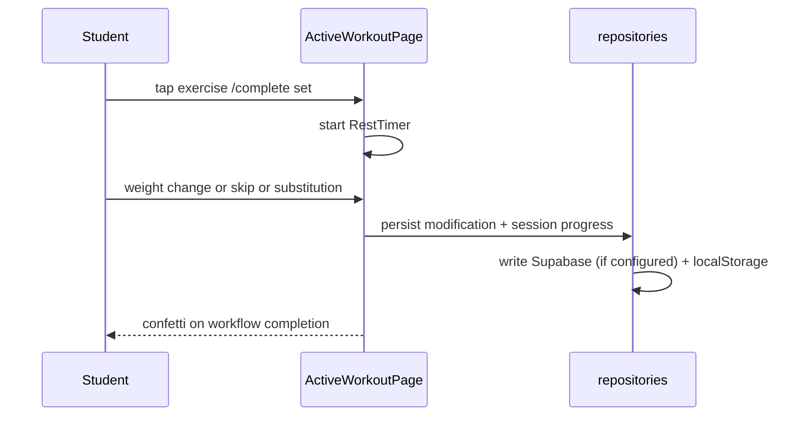

# student-portal

> Language: EN | [Português (pt-BR)](../../pt-BR/application/student-portal.md)
>
> Status: REVIEW
>
> Owner: rafaela-app
>
> Documentation Standard v1.0 (structure reference — content is original)

## Purpose

Student-side experience of the Rafaela Personal App: view prescribed workouts, execute them with tappable UI, log real sets, request substitutions, skip exercises with reason, and review history/evolution/nutrition.

## Responsibilities

| Responsibility | Evidence | Classification |
| --- | --- | --- |
| Student dashboard (today's workout card, streak, recent sessions) | `src/pages/student/StudentDashboardPage.tsx` | Confirmed |
| Active workout execution (frame player, rest timer, +/-, substitution, skip) | `StudentActiveWorkoutPage.tsx` | Confirmed |
| Workout list | `StudentWorkoutsListPage.tsx` | Confirmed |
| History (sessions + modifications) | `StudentHistoryPage.tsx` | Confirmed |
| Student evolution charts | `StudentEvolutionPage.tsx` | Confirmed |
| Nutrition plan with substitutions + demo disclaimer | `StudentNutritionPage.tsx` | Confirmed |
| Profile (theme, logout, switch-to-personal) | `StudentProfilePage.tsx` | Confirmed |

## Non-Responsibilities

- Not responsible for prescribing or auditing (trainer side).
- Does not write nutrition plans directly (trainer does).

## Routes

| Route | Page |
| --- | --- |
| `/student/dashboard` | Dashboard |
| `/student/workouts` | Workout list |
| `/student/workout/today` | Today's active workout |
| `/student/workout/active/:dayId` | Active workout day |
| `/student/history` | History |
| `/student/evolution` | Evolution |
| `/student/nutrition` | Nutrition |
| `/student/profile` | Profile |

## Execution flow (active workout)

## Technology

| Field | Value | Classification |
| --- | --- | --- |
| Framework | React 19 + react-router-dom 7 | Confirmed |
| Layout | `StudentLayout` (bottom nav) | Confirmed |
| Audio | Web Audio API beep (RestTimer) | Confirmed |
| Effects | canvas-confetti | Confirmed |

## Dependencies

| Dependency | Purpose | Classification |
| --- | --- | --- |
| `repositories` | All data access | Confirmed |
| `auth` | Session + role guard | Confirmed |
| `exercise-frame-player` | Animated exercise preview + rest timer | Confirmed |

## Related

- [../application/repositories.md](repositories.md)
- [../application/auth.md](auth.md)
- [../application/exercise-frame-player.md](exercise-frame-player.md)
- [../contracts/supabase-rest.md](../contracts/supabase-rest.md)