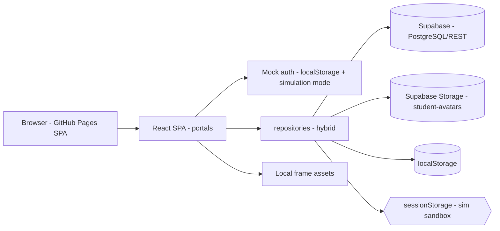

# Architecture overview

> Language: EN | [Português (pt-BR)](../../pt-BR/architecture/overview.md)
>
> Status: REVIEW
>
> Owner: rafaela-app
>
> Documentation Standard v1.0 (structure reference — content is original)

## Purpose

Document the **single-page application (SPA) + hosted backend services** shape: a React frontend served as a static site and a data layer that talks to Supabase (PostgreSQL + REST) with a transparent localStorage fallback.

## Context

Mobile-first web platform for a personal trainer and her students. Single-trainer operation model with mock authentication.

## Goals

| Goal | Notes | Classification |
| --- | --- | --- |
| Dual-portal UX (trainer + student) | Role-based routing | Confirmed |
| Prescription vs. executed auditability | Workout modifications trail | Confirmed |
| Offline-capable data layer | localStorage fallback when Supabase unconfigured/unreachable | Confirmed |
| Exercise animation without network | Local frame assets (302 exercises / 1,002 files) | Confirmed |

## Non-Goals

| Non-goal | Justification |
| --- | --- |
| Server-side rendering | Static SPA on GitHub Pages | Confirmed |
| Server-side API framework | Supabase hosted REST consumed directly | Confirmed |
| Microservices / brokers | No queue or split services | Confirmed |
| Real identity/auth | Mock auth; JWT is a declared next step | Unknown |

## System Boundary

| Inside | Outside |
| --- | --- |
| React SPA (both portals), localStorage, local frame assets | Supabase project (hosted), GitHub Pages hosting, `@bryllim/workout-guide` package, Free Exercise DB images |

## Main Components

| Component | Responsibility | Doc |
| --- | --- | --- |
| personal-portal | Trainer UX | [../application/personal-portal.md](../application/personal-portal.md) |
| student-portal | Student UX | [../application/student-portal.md](../application/student-portal.md) |
| repositories | Hybrid data access | [../application/repositories.md](../application/repositories.md) |
| exercise-catalog | Exercise catalog + frames | [../application/exercise-catalog.md](../application/exercise-catalog.md) |
| auth | Mock auth + route guards | [../application/auth.md](../application/auth.md) |
| exercise-frame-player | Animated frames + rest timer | [../application/exercise-frame-player.md](../application/exercise-frame-player.md) |
| workout-templates | Template sets + versioning | [../application/workout-templates.md](../application/workout-templates.md) |
| student-chat | Trainer↔student messages | [../application/student-chat.md](../application/student-chat.md) |

## Main Data Flows

```text
Personal / Student UI
        │
        ▼
repositories (hybrid)
   ├── Supabase (REST) ──────────► Supabase project (PostgreSQL)
   │      └── Storage bucket `student-avatars` (avatar photos)
   └── localStorage / sessionStorage (fallback, cache, simulation sandbox)
```

> In "Test as student" simulation mode, repository reads check a `sessionStorage` sandbox (`sim_sandbox_*`) first, and writes land in the sandbox only — Supabase writes are skipped and permanent localStorage is never mutated.

## Diagram



## Main Dependencies

| Dependency | Type | Purpose | Classification |
| --- | --- | --- | --- |
| Supabase project | runtime | Data persistence (10+ tables via migration; template/chat tables best-effort) | Confirmed |
| Supabase Storage | runtime (avatar photos) | Bucket `student-avatars`, path `avatars/*.jpg`; local Data-URL fallback | Confirmed |
| GitHub Pages | runtime | Static hosting | Confirmed |
| @bryllim/workout-guide | build/runtime | Exercise catalog + frames | Confirmed |
| Free Exercise DB (yuhonas) | data | Reference images (The Unlicense) | Confirmed |
| Vite build (`GITHUB_PAGES=true` base) | build | Static bundle | Confirmed |

## Security Boundaries

| Boundary | Inside | Outside |
| --- | --- | --- |
| Browser | localStorage, anon client key, session in localStorage | Server secrets never reach the client |
| Supabase policy | RLS enabled but "Allow all" open policies | — |
| Deploy secrets | `VITE_SUPABASE_*` injected by CI | Never committed | 

> See [../security/overview.md](../security/overview.md) for details.

## Failure Domains

| Domain | Failure | Fallback |
| --- | --- | --- |
| Supabase unreachable | Data reads fail | repositories fall back to localStorage |
| Supabase unconfigured | No REST configured | repositories use localStorage only |
| Supabase Storage upload fails | Avatar persisted with Data URL instead | Local optimistic write; `console.warn` |
| New tables missing in migration | `student_messages`/`workout_templates` queries error | Fallback to localStorage lists |
| GitHub Pages down | App unreachable | None (static hosting) |
| localStorage unavailable | Reads/writes fail silently | Repository returns fallback data |

## Related

- [system-context.md](system-context.md)
- [../application/README.md](../application/README.md)
- [../contracts/supabase-rest.md](../contracts/supabase-rest.md)
- [../contracts/local-storage.md](../contracts/local-storage.md)
- [../decisions/adr-001-hybrid-repository.md](../decisions/adr-001-hybrid-repository.md)
- [../security/overview.md](../security/overview.md)