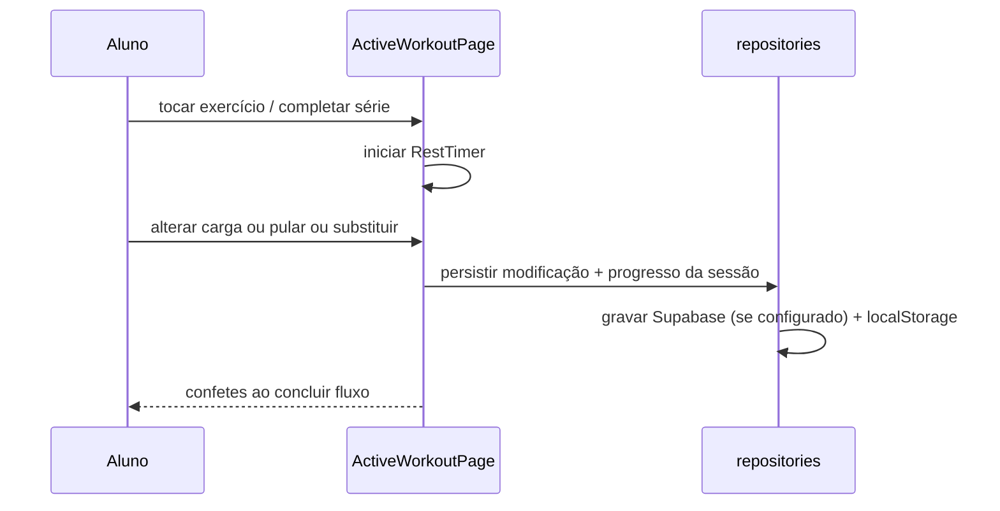

# student-portal

> Language: pt-BR | [English](../../en/application/student-portal.md)
>
> Status: REVIEW
>
> Owner: rafaela-app
>
> Documentation Standard v1.0 (referência de estrutura — conteúdo original)

## Propósito

Experiência do lado do aluno no Rafaela Personal App: ver treinos prescritos, executá-los com UI tátil, registrar séries reais, pedir substituições, pular exercícios com justificativa e revisar histórico/evolução/nutrição.

## Responsabilidades

| Responsabilidade | Evidência | Classification |
| --- | --- | --- |
| Dashboard do aluno (card do treino de hoje, streak, sessões recentes) | `src/pages/student/StudentDashboardPage.tsx` | Confirmed |
| Execução de treino ativo (player de frames, rest timer, +/-, substituição, pulo) | `StudentActiveWorkoutPage.tsx` | Confirmed |
| Lista de treinos | `StudentWorkoutsListPage.tsx` | Confirmed |
| Histórico (sessões + modificações) | `StudentHistoryPage.tsx` | Confirmed |
| Gráficos de evolução do aluno | `StudentEvolutionPage.tsx` | Confirmed |
| Plano nutricional com substituições + aviso demonstrativo | `StudentNutritionPage.tsx` | Confirmed |
| Perfil (tema, logout, trocar para personal) | `StudentProfilePage.tsx` | Confirmed |

## Não-responsabilidades

- Não é responsável por prescrever ou auditar (lado da treinadora).
- Não escreve planos nutricionais diretamente (a treinadora faz).

## Rotas

| Rota | Página |
| --- | --- |
| `/student/dashboard` | Dashboard |
| `/student/workouts` | Lista de treinos |
| `/student/workout/today` | Treino ativo de hoje |
| `/student/workout/active/:dayId` | Dia de treino ativo |
| `/student/history` | Histórico |
| `/student/evolution` | Evolução |
| `/student/nutrition` | Nutrição |
| `/student/profile` | Perfil |

## Fluxo de execução (treino ativo)

## Tecnologia

| Campo | Valor | Classification |
| --- | --- | --- |
| Framework | React 19 + react-router-dom 7 | Confirmed |
| Layout | `StudentLayout` (bottom nav) | Confirmed |
| Áudio | Beep via Web Audio API (RestTimer) | Confirmed |
| Efeitos | canvas-confetti | Confirmed |

## Dependências

| Dependência | Propósito | Classification |
| --- | --- | --- |
| `repositories` | Todo o acesso a dados | Confirmed |
| `auth` | Sessão + guard de papel | Confirmed |
| `exercise-frame-player` | Pré-visualização animada + rest timer | Confirmed |

## Relacionados

- [../application/repositories.md](repositories.md)
- [../application/auth.md](auth.md)
- [../application/exercise-frame-player.md](exercise-frame-player.md)
- [../contracts/supabase-rest.md](../contracts/supabase-rest.md)