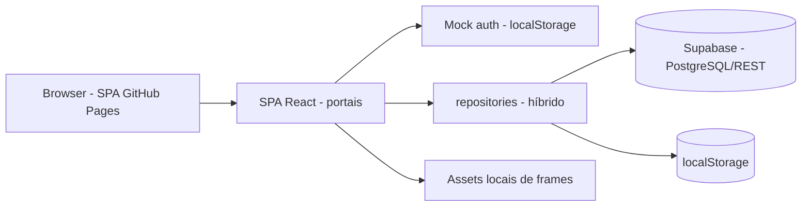

# Visão geral da arquitetura

> Language: pt-BR | [English](../../en/architecture/overview.md)
>
> Status: REVIEW
>
> Owner: rafaela-app
>
> Documentation Standard v1.0 (referência de estrutura — conteúdo original)

## Propósito

Documentar a forma **single-page application (SPA) + serviços de backend hospedados**: um frontend React servido como site estático e uma camada de dados que fala com o Supabase (PostgreSQL + REST) com fallback transparente para localStorage.

## Contexto

Plataforma web mobile-first para uma personal trainer e seus alunos. Modelo de operação com uma única treinadora e autenticação mock.

## Objetivos

| Objetivo | Notas | Classification |
| --- | --- | --- |
| UX de dois portais (treinadora + aluno) | Roteamento por papel | Confirmed |
| Auditoria de prescrito vs. executado | Trilha de modificações de treino | Confirmed |
| Camada de dados com capacidade offline | Fallback para localStorage sem Supabase | Confirmed |
| Animação de exercícios sem rede | Frames locais (302 exercícios / 1.002 arquivos) | Confirmed |

## Não-objetivos

| Não-objetivo | Justificativa |
| --- | --- |
| Server-side rendering | SPA estática no GitHub Pages | Confirmed |
| Framework de API server-side | REST hospedado do Supabase consumido diretamente | Confirmed |
| Microsserviços / brokers | Sem filas ou serviços separados | Confirmed |
| Identidade/auth real | Auth mock; JWT é próximo passo declarado | Unknown |

## Fronteira do sistema

| Dentro | Fora |
| --- | --- |
| SPA React (ambos portais), localStorage, frames locais | Projeto Supabase (hospedado), hospedagem GitHub Pages, pacote `@bryllim/workout-guide`, imagens Free Exercise DB |

## Componentes principais

| Componente | Responsabilidade | Doc |
| --- | --- | --- |
| personal-portal | UX da treinadora | [../application/personal-portal.md](../application/personal-portal.md) |
| student-portal | UX do aluno | [../application/student-portal.md](../application/student-portal.md) |
| repositories | Acesso híbrido a dados | [../application/repositories.md](../application/repositories.md) |
| exercise-catalog | Catálogo de exercícios + frames | [../application/exercise-catalog.md](../application/exercise-catalog.md) |
| auth | Auth mock + guards de rota | [../application/auth.md](../application/auth.md) |
| exercise-frame-player | Frames animados + timer de descanso | [../application/exercise-frame-player.md](../application/exercise-frame-player.md) |

## Principais fluxos de dados

```text
UI da Personal / Aluno
        │
        ▼
repositories (híbrido)
   ├── Supabase (REST) ──────────► Projeto Supabase (PostgreSQL)
   └── localStorage (fallback / cache)
```

## Diagrama



## Principais dependências

| Dependência | Tipo | Propósito | Classification |
| --- | --- | --- | --- |
| Projeto Supabase | runtime | Persistência (10 tabelas) | Confirmed |
| GitHub Pages | runtime | Hospedagem estática | Confirmed |
| @bryllim/workout-guide | build/runtime | Catálogo de exercícios + frames | Confirmed |
| Free Exercise DB (yuhonas) | dados | Imagens de referência (The Unlicense) | Confirmed |
| Build Vite (base `GITHUB_PAGES=true`) | build | Bundle estático | Confirmed |

## Fronteiras de segurança

| Fronteira | Dentro | Fora |
| --- | --- | --- |
| Browser | localStorage, chave anon do cliente, sessão em localStorage | Segredos de servidor nunca chegam ao cliente |
| Política Supabase | RLS habilitado, mas políticas "Allow all" abertas | — |
| Secrets de deploy | `VITE_SUPABASE_*` injetados pelo CI | Nunca commitados |

> Ver [../security/overview.md](../security/overview.md) para detalhes.

## Domínios de falha

| Domínio | Falha | Fallback |
| --- | --- | --- |
| Supabase inacessível | Leituras falham | repositories caem para localStorage |
| Supabase não configurado | Sem REST configurado | repositories usam somente localStorage |
| GitHub Pages fora | App inacessível | Nenhum (hospedagem estática) |
| localStorage indisponível | Leituras/escritas falham silencioso | Repository retorna dados de fallback |

## Relacionados

- [system-context.md](system-context.md)
- [../application/README.md](../application/README.md)
- [../contracts/supabase-rest.md](../contracts/supabase-rest.md)
- [../contracts/local-storage.md](../contracts/local-storage.md)
- [../decisions/adr-001-hybrid-repository.md](../decisions/adr-001-hybrid-repository.md)
- [../security/overview.md](../security/overview.md)